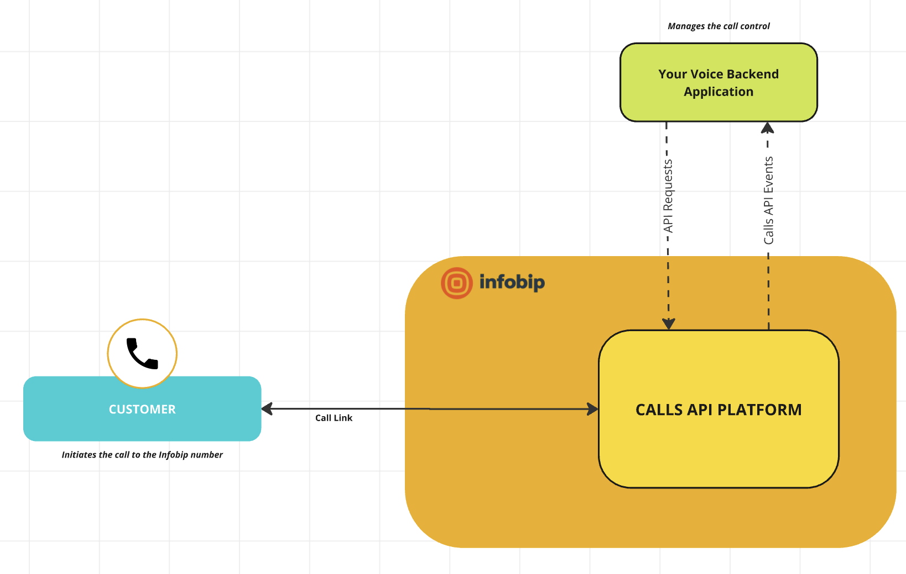

# Connecting your customers with ElevenLabs AI Agents through Infobip

With the emergence of conversational AI platforms, such as [ElevenLabs](https://elevenlabs.io/docs/conversational-ai/overview),
businesses can now provide their customers with a more personalized and engaging experience. 
In this guide you will learn how to connect your customers with ElevenLabs AI Agents through Infobip, by using
[Infobip Calls API](https://www.infobip.com/docs/voice-and-video/calls) for call orchestration and
[audio streaming over Websocket](https://www.infobip.com/docs/voice-and-video/calls#media-streaming-understanding-calls-api)
for exchanging audio with your AI agent.

## Prerequisites

Before you begin, you need to have the following:

- An [Infobip account](https://www.infobip.com/signup)
- An [ElevenLabs account](https://elevenlabs.io/signup)
- For local testing, we will use [ngrok](https://ngrok.com/download) to expose our local server to the internet.

## Overview

In order to use Calls API we first need a backend application for call orchestration. This application will be
responsible for handling events from Infobip and performing actions like connecting two calls together.

## Preparing your Infobip account

### Acquiring an API key

Once you signed up for an Infobip account, you can go straight to [API keys](https://portal.infobip.com/dev/api-keys)
and create one for your application. You will need this key to authenticate your requests towards Calls API.

When creating the API key, make sure to select the following API scopes:
- `calls:traffic:receive` - To perform actions on incoming calls
- `calls:manage` - TODO

Once created, make sure to copy it and save it in a secure place, as you won't be able to see it again after a short while.

### Creating a calls configuration

Next step is creating a calls configuration. This configuration is the cornerstone of our application and all logic
we implement will be connected to this configuration. For the sake of this tutorial, it's enough to create one using
[the corresponding portal page](https://portal.infobip.com/channels-and-numbers/channels/voice-and-webrtc/calls-api/calls-configurations).
Click on "Create calls configuration" and specify a name and ID that suits you. For this tutorial, we will use the following values:


### Configuring Webhooks
The next step is telling Calls API to subscribe our calls configuration to certain events, e.g. when a new call is
received. To do this, we need to [create a subscription](https://portal.infobip.com/dev/subscriptions#subscription).
Once you click "Create subscription" you will be presented with a form where you can specify the following values:

#### Channel
Select **VOICE_VIDEO** from the dropdown

#### Select events to subscribe to
Here we specify all events that our backend application needs to be notified about. 
The events needed for our application are:
- `CALL_RECEIVED` - When a new inbound call is received. For this tutorial we will auto-accept all calls that we receive.
- `CALL_ESTABLISHED` - When a new inbound call has been established. Received once the call has been successfully accepted and established.

That's it! There are plenty of more events to choose from, but for the sake of this tutorial, we will stick to these two.

### Subscription name
Type in an arbitrary name for the subscription. For this tutorial, we will use "elevenlabs_tutorial".

#### Calls Configuration
In this dropdown, select the previously created configuration.

#### Notification profile
Select "New notification profile"

#### Profile ID
Type in an arbitrary identifier for the profile. For this tutorial, we will use "elevenlabs_tutorial".

#### Webhook URL
This is the key part of our setup. Here we need to specify the URL of our backend application that will handle the events.

If you are using ngrok for local testing, you can copy your [ngrok domain](https://dashboard.ngrok.com/domains) and
simply append `/webhook` to it. For example, `http://your_awesome_domain.ngrok-free.app/webhook`.

Everything else can be left at their default values. Click "Save" and you are done!

💡 Hint - In case your URL changes, you can always update your newly created [notification profile](https://portal.infobip.com/dev/subscriptions#profiles).
Keep in mind that changes aren't applied immediately and you might need to wait a couple of minutes for them to take effect.

### Setting up the backend application

Now that we have our Infobip account set up, we can move on to setting up our backend application. 
For this tutorial we will create a small NodeJS application that will act as our orchestration service.
We will use [Express](https://expressjs.com/) for our HTTP server and [axios](https://axios-http.com/docs/intro) for
our HTTP client. 

Open up your terminal of choice and create a new npm project.
```bash
npm init -y
npm install --save express axios
```

Next, create a new file called `app.js` and paste the following code:
```javascript
const express = require('express');
const https = require('https');
const axios = require('axios');
const app = express();

async function handleCallEstablished(event) {
    // TODO handle call established event
}

async function handleCallReceived(event) {
    // TODO handle call received event
}

app.use(express.json());

app.post('/webhook', async (req, res) => {
    // A new infobip calls event is received. For more information about possible events and their model, see here:
    // https://www.infobip.com/docs/api/channels/voice/calls/calls-applications/calls-event-webhook
    const event = await req.body;
    console.log("Received event from Infobip: ", event);

    const type = event.type;
    switch (type) {
        case "CALL_RECEIVED":
            handleCallReceived(event);
            break;
        case "CALL_ESTABLISHED":
            handleCallEstablished(event);
            break;
    }

    res.status(200).send();
});

app.listen(3000, () => {
    console.log('Server is running on http://localhost:3000')
});
```

Although we don't do any action on event reception yet, we are now able to test integration with Calls API.

Start the server by running `node app.js`, and you should see the following output:
```bash
$ node app.js
Server is running on http://localhost:3000
```

If you are using ngrok, make sure it's started with:
```bash
ngrok tcp 3000
```

You should also make sure the domain you see under `Forwarding` is the same one you used when creating the subscription!

### Receiving the first call

With both ngrok and your application running, we can now perform a test call to verify we are receiving call events.

There are many ways how your customers can "call" your business, some examples would be:
- **Buying a number from Infobip** - Once someone calls that number, your backend application would get the corresponding
event to process the call 
- **WebRTC integration** - Using our [WebRTC SDK](https://www.infobip.com/docs/voice-and-video/webrtc), 
you can initiate audio/video calls from your own application, providing a seamless experience.
- **Call link** - A no-code solution from Infobip. Simply generate a preconfigured URL with your customers, and when they
visit it the call will be initiated. This is what we will do in this tutorial, since it's the fastest way to get started.

#### Creating a call link

Back in Infobip portal, navigate to [Call Link](https://portal.infobip.com/channels-and-numbers/channels/voice-and-webrtc/call-link/call-links) management
and create a new call link. You can customize it to your liking, but make sure that for **"Call destination type"** you
select **"Application"**, and under **"Application ID"** type in the **"Calls Configuration ID"** you previously created.


Also notice the **"Validity window"** section. By default, call links are valid for 24 hours, which is enough for our testing.
You can fill the remaining fields as you see fit, but we will leave them at their default values for this tutorial. 

After clicking "Create", you will see the URL for your newly created call link. Copy it and open it in your browser.

#### Bringing it all together

Once you open the call link, you should see a screen similar to this:


Configure the call as you see fit and click the call icon. This will initiate a new WebRTC call towards Infobip, and
if everything else is set up correctly, your backend should be notified about this through the corresponding
`CALL_RECEIVED` event!


After a while the call will terminate since we didn't do anything with it, but you can now see that everything we did so
far is up and running. If you didn't receive the event, check the previous steps for any details you might have missed
before proceeding with the tutorial.

#### Answering the call

Now that we are being notified about an inbound call, we can go ahead and answer it. For this we will need
to perform an [HTTP call towards Calls API](https://www.infobip.com/docs/api/channels/voice/calls/call-legs/answer-call).

Modify the `handleCallReceived` method:

```javascript
    // TODO
```

Now once we receive a call, it will be answered and established. With this we have completed the handling of the inbound
call, and what's left is to connect it with another call. Below is a short overview of the architecture we have built so far:



## Preparing your ElevenLabs account

Now that we're done setting up our basic integration with Infobip services, it's time to set up our ElevenLabs account.

Once you signed up for a free trial account, navigate to [ElevenLabs AI Agents dashboard](https://elevenlabs.io/app/conversational-ai/agents).
Here you can create a new AI Agent by clicking the "+" button. Configure the agent to your liking, for example:


Once created, select the newly created agent in the list and take note of the **Agent ID** (shown under the agent name).
We will need this ID to connect our backend application with the AI Agent.

️️⚠️ Important - under **"Advanced"** settings, verify that **User input audio format** is set to **"PCM 16000 Hz"**. This
is the audio format that we will be exchanging with Infobip.


That's it! Now we can go back to our backend application and finally connect our inbound call with the AI agent.

### Connecting the call with the AI Agent

In order to integrate with ElevenLabs WebSocket API, we need to add the `ws` package to our project.

```bash
npm install --save ws
```

Once installed, we can create a new conversation with the AI agent once we establish a call with our customer.
Modify the previously left empty method `handleCallEstablished`:

```javascript
    // TODO
```

## Next steps

Now that you can talk with the AI Agent via Call Link (WebRTC), you can explore other use cases such as
[receiving phone calls](https://www.infobip.com/docs/voice-and-video/configure-inbound-calls) and connecting them with AI Agents.
Using other Calls API features you are also able to dictate when to switch between AI agents and possibly involve a live
agent in the conversation as well, whatever fits your business needs.

⚠️ Note regarding security: To keep the tutorial as simple as possible, various security measures were omitted.
Before considering a production environment, you should investigate what kind of authentication Infobip and ElevenLab
offer as part of their APIs. Also, your backend application should be secured with TLS (HTTPS and WSS) with a valid certificate.
